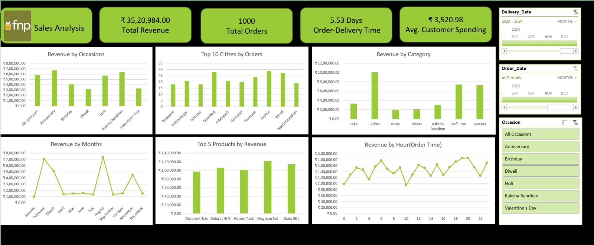

# Ferns & Petals (FNP) Sales Analysis – Excel Project

## Project Overview
This project presents an end-to-end **sales analysis for Ferns & Petals (FNP)**, a gifting company operating across multiple occasions such as Diwali, Raksha Bandhan, Holi, Valentine’s Day, Birthdays, and Anniversaries.

The goal of this project is to analyze **sales performance, customer behavior, product trends, delivery efficiency, and time-based ordering patterns** using Microsoft Excel and to summarize insights through an interactive dashboard.

---

## Problem Statement
Ferns & Petals wants to gain better visibility into:
- Overall revenue and order performance  
- Customer purchasing behavior  
- Occasion-wise and product-wise sales trends  
- Delivery time efficiency  
- Geographic distribution of orders  

The analysis aims to answer these business questions using historical sales data.

---

## Tools Used
- Microsoft Excel  
- Power Query (Excel)  
- Pivot Tables & Pivot Charts  
- Slicers and Filters  
- Excel Dashboard Design  

---

## Dataset Description
The analysis is based on three datasets:

### Orders Dataset
- Order ID  
- Order Date  
- Delivery Date  
- Order Time  
- Quantity  
- Occasion  
- Delivery Time  

### Customers Dataset
- Customer ID  
- Customer Name  
- City  
- Gender  

### Products Dataset
- Product ID  
- Product Name  
- Category  
- Price  

---

## Data Cleaning & Data Modeling
Data preparation and modeling were performed using **Power Query in Excel**.

Key steps included:
- Handling missing and inconsistent values  
- Standardizing data types (dates, numeric, currency)  
- Merging Orders, Customers, and Products datasets into a **single consolidated fact table**  
- Creating calculated columns:
  - **Revenue = Quantity × Price**
  - **Order-to-Delivery Time (Days)**  

This approach represents **data modeling using a flat (denormalized) structure**, suitable for pivot-based analysis in Excel Home & Student edition.

---

## Dashboard Overview
The Excel dashboard provides insights through the following KPIs and visuals:

### Key KPIs
- Total Revenue  
- Total Orders  
- Average Customer Spending  
- Average Delivery Time  

### Visual Analysis
- Revenue by Occasion  
- Monthly Revenue Trend  
- Top 10 Cities by Orders  
- Revenue by Product Category  
- Top 5 Products by Revenue  
- Revenue by Order Hour  

Interactive slicers allow filtering by date and occasion.

---

## Additional Analysis
An additional statistical analysis was conducted to study the relationship between **order quantity and delivery time**.

- **Correlation coefficient:** `0.0035`

This indicates **no significant relationship** between order size and delivery duration, suggesting that higher quantities do not negatively impact delivery performance.

---

## Key Insights
- Sales are strongly driven by **occasion-based demand**, with Anniversaries, Raksha Bandhan, and Holi contributing the highest revenue.
- A small group of products and categories generates a major share of revenue.
- Urban cities dominate order volume, offering scope for localized marketing and logistics optimization.
- Orders are most frequently placed during **midday and evening hours**.
- Delivery operations remain stable regardless of order quantity.

---

## Conclusion
This project demonstrates a complete **Excel-based analytics workflow**, including data cleaning, data modeling using Power Query, dashboard creation, and business insight generation.  
The insights can help improve sales planning, promotional strategy, and delivery operations.

---

The repository contains raw datasets, a cleaned dataset, the Excel dashboard, dashboard visuals, and a project report.

## Dashboard Preview

---

## Author
**Ajay Singh**  
Aspiring Data Analyst
